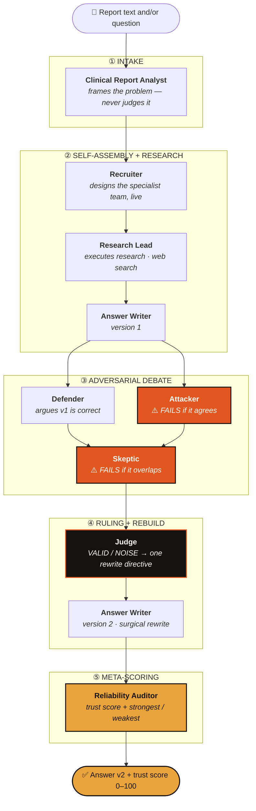
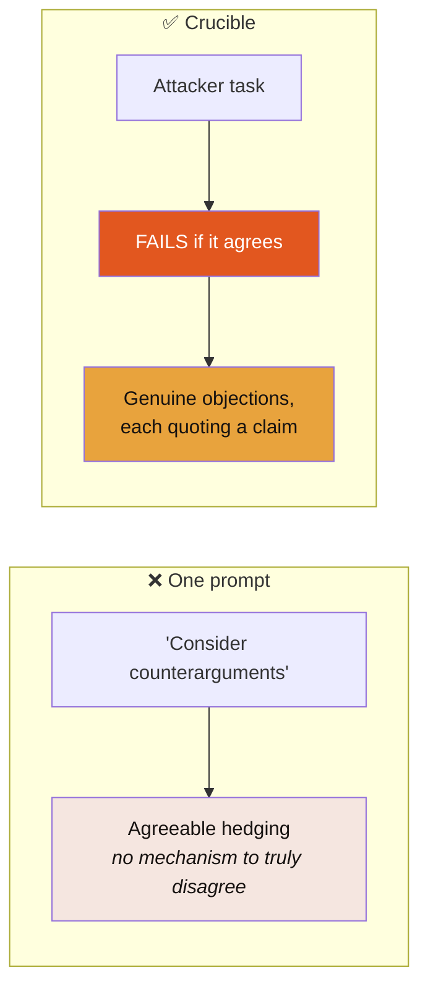
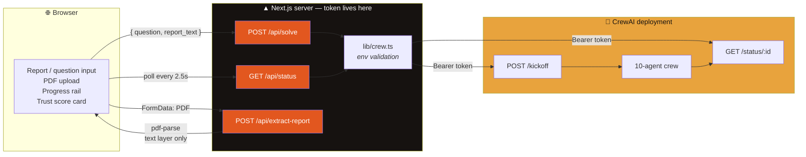
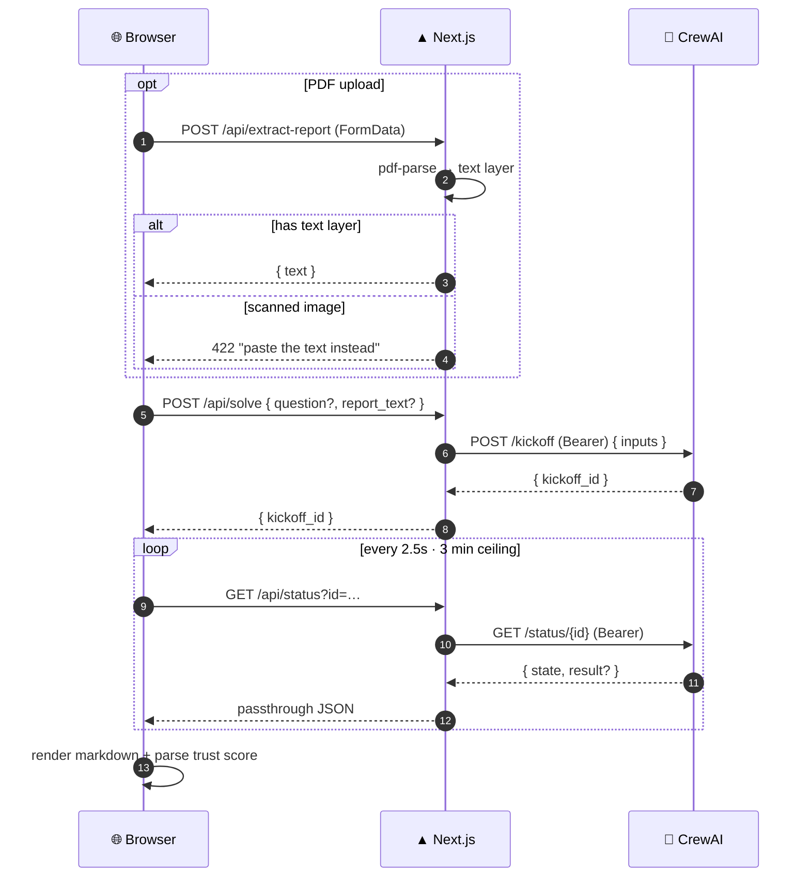
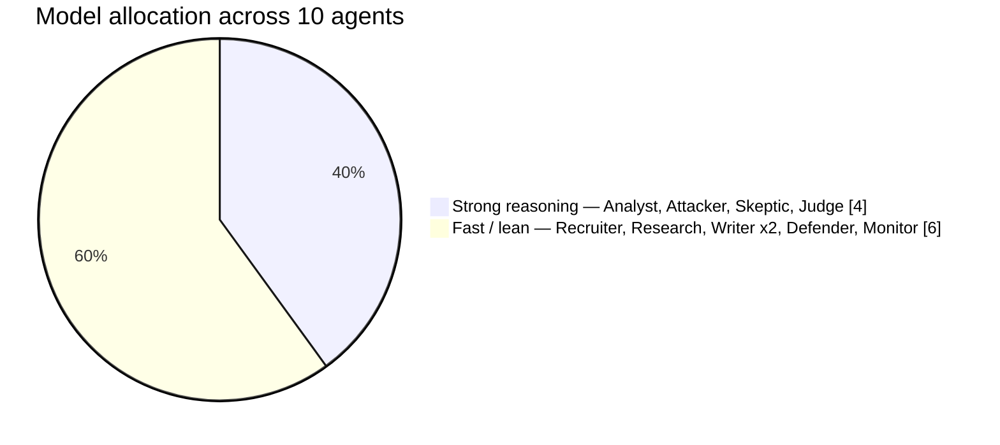
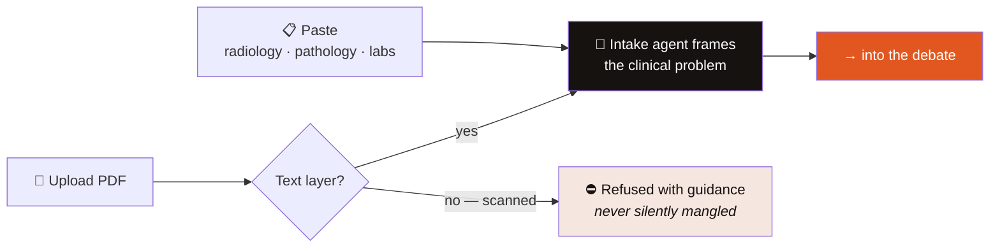

<div align="center">

# 🔥 Crucible

### An AI that argues with itself — and tells you how far to trust the result.

**Ten agents. Four stacked patterns. One structural guarantee: the critic *fails its task* if it agrees.**

[](https://nextjs.org)
[](https://react.dev)
[](https://typescriptlang.org)
[](https://crewai.com)
[](LICENSE)

</div>

---

## The one-sentence version

Give Crucible a diagnostic report or any high-stakes question. It assembles its own specialist team, researches the problem live, writes an answer — then makes its own agents **attack that answer** before you ever see it. A judge rules which objections survive, the answer is rebuilt around the strongest one, and a reliability auditor returns a **trust score from 0 to 100**.

> **No single model can genuinely disagree with itself.** That is the entire reason this is a multi-agent system and not one long prompt.

---

## Why this exists

| | |
|---|---|
| **795,000** | Americans killed or permanently disabled every year by diagnostic error<sup>[1]</sup> |
| **$100B+** | Annual cost to U.S. healthcare |
| **Jan 2026** | FDA loosened oversight of AI clinical decision support, leaning on clinician review as the safety net |

The FDA's safety net assumes a human challenges the AI. In practice, clinicians defer to confident machines — and LLMs fail in one specific way: *clinically plausible, factually wrong.*

**Crucible is that missing challenge, automated.**

<sub>[1] BMJ Quality & Safety / Johns Hopkins, 2023; AHRQ</sub>

---

## Functional architecture

How a question becomes a scored, debated answer.



### The ten agents

| # | Agent | Responsibility | Failure condition |
|:--:|---|---|---|
| 1 | **Clinical Report Analyst** | Extracts stated diagnosis, supporting and contradicting findings, unresolved ambiguities. Frames — does not solve. | — |
| 2 | **Recruiter** | Designs 3–5 specialists specific to *this* problem | — |
| 3 | **Research Lead** | Executes each specialist's research. **Only tool-holding agent** (web search) | — |
| 4 | **Answer Writer** | Produces answer version 1 | — |
| 5 | **Defender** | Argues v1 is correct, quoting ≥3 supported claims | — |
| 6 | **Attacker** | ≥3 objections, each quoting the exact claim attacked | 🔴 **Fails if it agrees** |
| 7 | **Skeptic** | ≥2 blind spots both others missed | 🔴 **Fails if it overlaps** |
| 8 | **Judge** | Rules VALID/NOISE per objection, issues one rewrite directive | 🔴 Fails if it merely summarises |
| 9 | **Answer Writer** *(reused)* | Version 2 — applies the directive as one surgical rewrite | — |
| 10 | **Reliability Auditor** | Trust score 0–100 + strongest and weakest sentence | — |

### Why the failure conditions matter

They are enforced **in the task definitions**, not requested politely in a prompt.

A single model asked to "consider counterarguments" has no mechanism to genuinely disagree with itself — it produces agreeable hedging. Here, an Attacker that agrees has *failed its task*. That structural guarantee is the whole thesis.



---

## Technical architecture

The browser **never** contacts the CrewAI API. Every call is proxied server-side, so the bearer token stays in server env and CORS is never a factor.



### Request lifecycle



### API surface

| Route | Method | Input | Output | Errors |
|---|:--:|---|---|---|
| `/api/solve` | `POST` | `{ question?, report_text? }` — at least one | `{ kickoff_id }` | `400` neither given · `500` env missing · `502` kickoff failed |
| `/api/status` | `GET` | `?id=<kickoff_id>` | Crew status JSON | `400` no id · `500` env missing · `502` upstream failure |
| `/api/extract-report` | `POST` | `FormData` with `file` | `{ text }` | `400` no file · `422` no text layer |

---

## Model strategy

Strong reasoning where the reasoning is hard. Lean models everywhere else.



| Tier | Agents | Rationale |
|---|---|---|
| 🔥 **Strong** <br/><sub>claude-sonnet-4.5 · gpt-4o · o3 · gemini-2.5-pro</sub> | Report Analyst, Attacker, Skeptic, Judge | Must catch subtle errors, avoid mutual overlap, and separate valid from noise |
| ⚡ **Lean** <br/><sub>gpt-4o-mini · claude-haiku-4.5 · gemini-2.5-flash</sub> | Recruiter, Research Lead, Answer Writer ×2, Defender, Monitor | Execution, synthesis, formatting — a frontier model adds latency and cost, not quality |

> **Measured, not assumed:** on a lean model the Judge rubber-stamped *every* objection as VALID and the debate went flat. That is the split earning its place.

---

## The product

### Two input modes

| Mode | Inputs | Behaviour |
|---|---|---|
| **Review a report** | `report_text` required, `question` optional | Intake agent frames the report. No question given → defaults to *"Is this diagnosis correct and complete?"* |
| **Ask a question** | `question` required | General decision-making system — the original, proven path |

### Report intake



### What the user sees

While the crew runs (~60s), an eight-step progress rail advances so there is never a bare spinner. When it lands, the trust score card surfaces the score plus the strongest and weakest claims, with the rebuilt answer rendered in full beneath.

---

## Quick start

```bash
git clone https://github.com/techadnank9/crucible.git
cd crucible
npm install
cp .env.local.example .env.local
```

Fill in `.env.local`:

```env
CREW_URL=https://your-crew-name.crewai.com
CREW_TOKEN=your-bearer-token-here
```

```bash
npm run dev
```

Open **http://localhost:3000**.

> Without the env vars the UI loads and every control works — submitting returns a clear configuration error rather than failing silently.

---

## Deploy

[](https://vercel.com/new/clone?repository-url=https://github.com/techadnank9/crucible)

1. Import the repo at [vercel.com/new](https://vercel.com/new)
2. Add environment variables under **Project Settings → Environment Variables**:
   - `CREW_URL`
   - `CREW_TOKEN`
3. Deploy

Both variables are read **server-side only** — neither is prefixed `NEXT_PUBLIC_`, so neither can reach client code.

> 🔐 Rotate the bearer token in CrewAI Studio after any public demo, and update the Vercel variable to match.

---

## Building the crew

The crew itself lives in CrewAI Studio. To rebuild it from scratch, paste the scaffold prompt into Studio (choose **Crews**, not Flows) — it specifies all ten agents, the sequential task flow, and the per-role model split.

Verification checklist after scaffolding:

- [ ] Intake task runs **before** the Recruiter
- [ ] `report_text` appears as an input on the Run/Kickoff tab
- [ ] A question-only run (blank `report_text`) still works
- [ ] The Attacker quotes **exact claims** — not vague concerns
- [ ] The Judge rules at least one objection VALID and forces a real rewrite, so v2 differs from v1

If the Attacker comes back polite, harden its goal field and re-run. A flat debate is the one failure mode that invalidates the whole system.

---

## Project structure

```
app/
├── layout.tsx                  fonts, metadata
├── page.tsx                    mode toggle, inputs, polling state machine
├── globals.css                 forge palette, hard shadows, heat glow
└── api/
    ├── solve/route.ts          kickoff proxy
    ├── status/route.ts         status proxy
    └── extract-report/route.ts PDF text extraction
components/
├── ProgressRail.tsx            7-step rail (8 in report mode)
└── ResultView.tsx              markdown render + trust score card
lib/
├── crew.ts                     env access and validation
├── parseResult.ts              completion detection, trust score parsing
└── samples.ts                  synthetic test reports
docs/
├── Crucible.pptx               21-slide deck with speaker notes
├── DECK.md                     deck content and anticipated Q&A
└── STORYBOARD.md               3-minute demo script and failure playbook
```

---

## Key implementation decisions

<details>
<summary><b>Progress is timer-driven, not event-driven</b></summary>

The CrewAI status endpoint reports overall state, not which agent is currently executing. The rail advances on a ~9s timer to give the ~60s run visible motion. It is an honest approximation of pipeline position, not a live trace.
</details>

<details>
<summary><b>Completion detection is defensive</b></summary>

`isDone()` accepts `SUCCESS`, `COMPLETED`, `COMPLETE`, or `DONE`, *or* the presence of a result field — deployments differ in which they report. `extractResultText()` handles `result` as both a string and `result.raw`.
</details>

<details>
<summary><b>PDF extraction is text-layer only — no OCR</b></summary>

Scanned or photographed reports return `422` telling the user to paste text instead. A silent partial read of a medical document is worse than a clear refusal.
</details>

<details>
<summary><b>serverExternalPackages is required, not optional</b></summary>

`pdfjs` resolves its worker from disk at runtime. Bundling it breaks that path with `Setting up fake worker failed`. Hence `serverExternalPackages: ["pdf-parse", "pdfjs-dist"]` in `next.config.ts`.
</details>

<details>
<summary><b>Trust score parsing is best-effort</b></summary>

`parseTrustScore()` regex-matches the score and strongest/weakest lines out of free-form model output. If the pattern does not match, the card is omitted and the full answer still renders — the result is never withheld because the decoration failed.
</details>

### Failure modes

| Failure | Handling |
|---|---|
| Env vars missing | `500` naming both variables explicitly |
| Non-2xx on kickoff | `502`, upstream status and body surfaced |
| No `kickoff_id` returned | `502` with explicit message |
| Crew reports `FAILED` | Polling stops, error shown in UI |
| Run exceeds 3 minutes | Timers cleared, timeout message shown |
| Completed but empty result | Treated as an error, never as blank success |
| PDF has no text layer | `422` directing the user to paste |
| Component unmounts mid-poll | `useEffect` cleanup clears both timers |

---

## Stack

**Next.js 16** (App Router, Turbopack) · **React 19** · **TypeScript 5** · **Tailwind CSS v4** · **react-markdown** + remark-gfm · **pdf-parse v2** · **CrewAI** (hosted deployment)

---

## Roadmap

- [ ] **Calibration study** — does the trust score actually track correctness?
- [ ] **Clinical pilot** — retrospective cases measured against known outcomes
- [ ] **FHIR / EHR integration** — reports flow in automatically
- [ ] **Streaming agent trace** — replace the timer rail with live per-agent events
- [ ] **Other domains** — the same review layer for law, finance, insurance

---

## Documentation

| File | Contents |
|---|---|
| [`docs/Crucible.pptx`](docs/Crucible.pptx) | 21-slide deck, speaker notes with timings on every slide |
| [`docs/DECK.md`](docs/DECK.md) | Deck content, honesty guardrails, anticipated Q&A |
| [`docs/STORYBOARD.md`](docs/STORYBOARD.md) | 3-minute demo script, failure playbook, claims discipline |

---

## ⚠️ Disclaimer

**Crucible is not a medical device.** It is a demonstration of an adversarial review pattern.

- Not validated for clinical use
- The trust score is **not** a calibrated probability — it is a reliability signal from a dedicated auditor agent
- **Never enter real patient data.** The bundled sample reports are synthetic and fictional
- Claims a *working pattern with a healthcare beachhead* — not that misdiagnosis is solved

---

## License

[MIT](LICENSE)

---

<div align="center">

### *An AI that doubts itself on purpose.*
### *And that's the one thing that makes it safe to act.*

</div>
